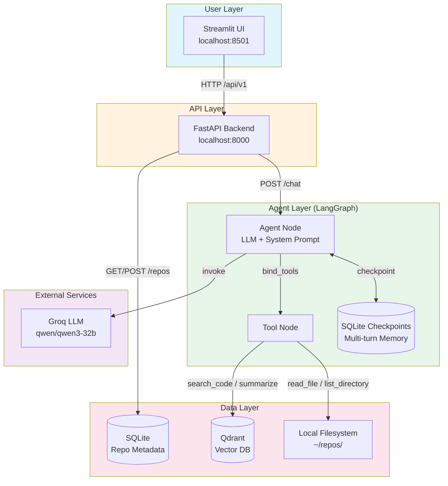

# Codebase Q&A Agent

An intelligent agent that answers natural language questions about any public GitHub repository. Built with FastAPI, LangGraph, Qdrant, Groq, and Streamlit. 

## Features

- **Dynamic Repo Indexing**: Paste any GitHub URL in the UI and the agent clones, parses, embeds, and indexes it automatically.
- **Structure-Aware Chunking**: Uses Tree-sitter to split code at function/class boundaries.
- **Agentic Q&A**: LangGraph-powered agent dynamically chooses between search, read, list, and summarize tools.
- **Streaming Responses**: Real-time token streaming with source citations.
- **Persistent Memory**: SQLite stores sessions; LangGraph `AsyncSqliteSaver` checkpoints agent state for true multi-turn memory.


## Tech Stack

| Component | Choice |
|-----------|--------|
| LLM | Groq (`qwen/qwen3-32b`) |
| Embeddings | `all-MiniLM-L6-v2` (local) |
| Vector DB | Qdrant (local Docker) |
| Agent Framework | LangGraph + AsyncSqliteSaver |
| Backend | FastAPI (port 8000) |
| Frontend | Streamlit (port 8501) |
| Code Parser | Tree-sitter |


## Architecture



**Request Flow:**
1. **User** asks a question in the Streamlit UI
2. **FastAPI** receives the request and loads the repo context
3. **LangGraph Agent** (up to 3 tool rounds):
   - Round 1: `search_code` → finds relevant chunks in Qdrant
   - Round 2: `read_file` or `list_directory` → reads full source
   - Round 3: Answers with citations
4. **Response** streams back as SSE tokens + source citations

**Index Flow:**
1. User submits GitHub URL → SQLite stores metadata
2. Background worker clones repo to `~/repos/`
3. Tree-sitter parses files → chunks functions/classes
4. Embeddings (dense + sparse) → upserted to Qdrant

---

## Project Setup

### Prerequisites

- python 3.12
- [uv](https://docs.astral.sh/uv/getting-started/installation/) (Python package manager)
- Docker (for Qdrant Vector Database)
- [Groq API key](https://console.groq.com).

### Installation

1. Clone the respository
    ```bash
    git clone https://github.com/Ghost-141/CodeQuery.git
    cd CodeQuery 
    ```

2. Create & Activate Environment

    ```bash
    python -m venv .venv
    source .venv/bin/activate  # Linux/macOS
    .venv\Scripts\activate     # Windows
    pip install uv
    uv sync
    ```


### Environment Configuration:

Create a `.env` file in the root directory. Paste the followings in that file:

```bash

LLM_PROVIDER=groq

# Groq API Key - get one at https://console.groq.com
GROQ_API_KEY=your_groq_api_key


# Ollama (local LLM) - used when LLM_PROVIDER=ollama
# Make sure Ollama is running: `ollama serve`
# Install model: `ollama pull llama3.1:8b`
OLLAMA_BASE_URL=http://localhost:11434
OLLAMA_MODEL=llama3.2:latest

# Qdrant
QDRANT_HOST=localhost
QDRANT_PORT=6335

# FastAPI
API_HOST=0.0.0.0
API_PORT=8000

# Models
EMBEDDING_MODEL=all-MiniLM-L6-v2
LLM_MODEL=qwen/qwen3-32b
```

### Run the Project

Run the project in following sequence to avoid any errors. The database docker container should be run first as without database the system will fail.

- Run Qdrant Vector Database
    ```bash
    rav run db
    ```
- Run backend
    ```bash
    rav run backend
    ```

- Run frontend
    ```bash
    rav run frontend
    ```

Qdrant Vector Database will be available at `http://localhost:6333`.

Backend will be available at: `http://localhost:8000/`

The UI will open at `http://localhost:8501`.


## Interaction with the UI:
- paste the github link and click on `Start Indexing`
- The UI will show the status of the indexing to embedding
- Once embedding is done click on the `Chat` button to start chatting with the codebase


## AI Usage

This project was developed with AI assistance for:
- **Code Generation**: Boilerplate code, API endpoints, and utility functions
- **Documentation**: README and inline code comments

All AI-generated code was reviewed, tested, and integrated manually to match with project requiremets.

## References

- [FastAPI](https://fastapi.tiangolo.com/advanced/)
- [LangChain Custom Tools](https://python.langchain.com/docs/how_to/custom_tools/)
- [Qdrant Hybrid Search](https://qdrant.tech/course/essentials/day-3/hybrid-search-demo/)
- [Code Parser](https://github.com/tree-sitter/py-tree-sitter) 
- [Agent Tool Calling](https://python.langchain.com/docs/concepts/tool_calling/)